# 2020.08.03 至今 在 資訊公司 擔任 FAE（Field Application Engineer）技術諮詢

## 任職後，於此新成立的部門

### 主動支援

- 建設 FAE 網路班表制度 並 結合 Google 日曆及 自動 [LINE Notify](https://notify-bot.line.me/zh_TW/) 、[JANDI.com](https://www.jandi.com) 同步定時提醒各群組。
[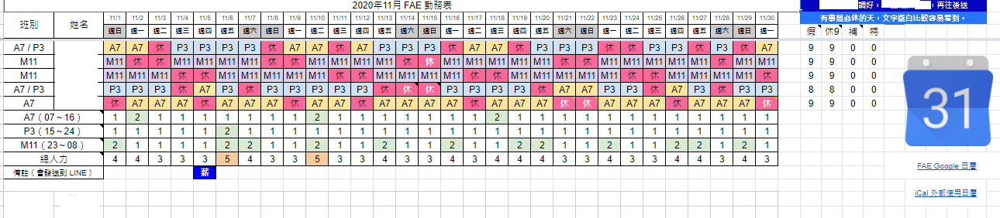](41.png)
[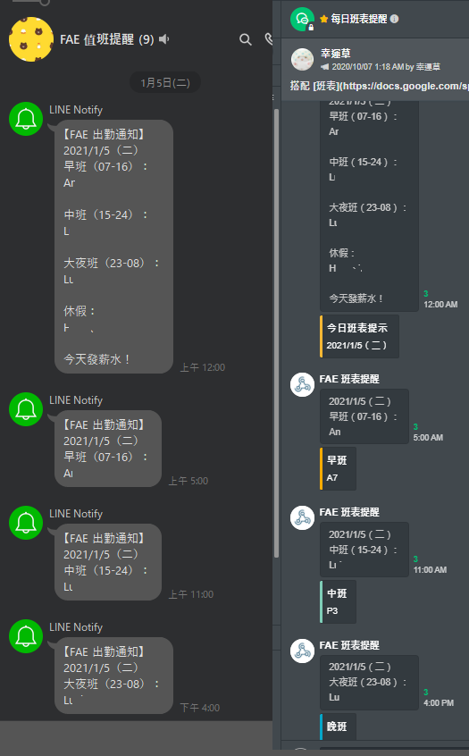](42.png)
[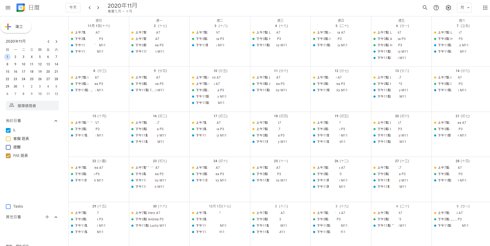](43.png)
- 整理並隨時更新內部常見客戶 FAQ。
- 整理 FAE 代表話術及情境、案件分析、支援教學撰寫教案、精準流程圖、心智圖等教學文件。
- 協助測試、規劃 / 改善 FAE 作業流程 SOP。
- 主動受理後進 FAE 任何諮詢協助解決。
- 檯面下機動性值班勤務支援。

### 工作流程、專案管理、企業內部通訊

- 推動 Trello.com + Google Sheet +  [LINE Notify](https://notify-bot.line.me/zh_TW/) 群組自動通知 + [JANDI.com](https://www.jandi.com)  的 工作流程
  - 快速查詢 Trello 的用法教學：
[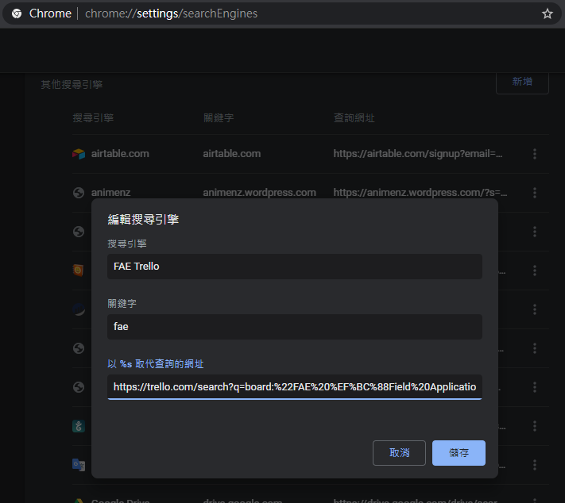](56.png)
## 自主開發程式

- 開發 JavaScript 強化網站工具，並透過 Tampermonkey 讓各 FAE 可以輕鬆執行
  - 對客服平台增加
    - 進線同步通知 LINE Notify 群組通知：
三十秒連續明顯即時提示，讓大家提醒大家。
明顯提示有最新用戶等待關懷處理，避免漏接。
也能透過 LINE 對話記錄，不同班別也能確切了解每人被指派的時機、案例。
[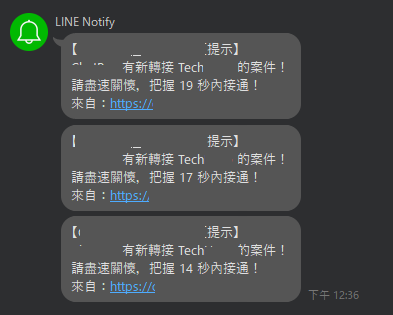](53.png)
[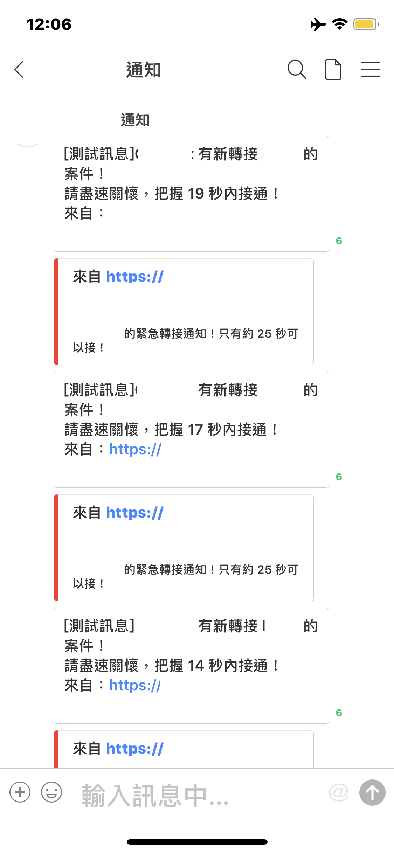](54.png)
    - 值機狀態 LINE Notify 群組通知：
加寫程式於文字客服系統內，每位值機人員能即時掌握登出入、休息狀態互相幫忙時機。
[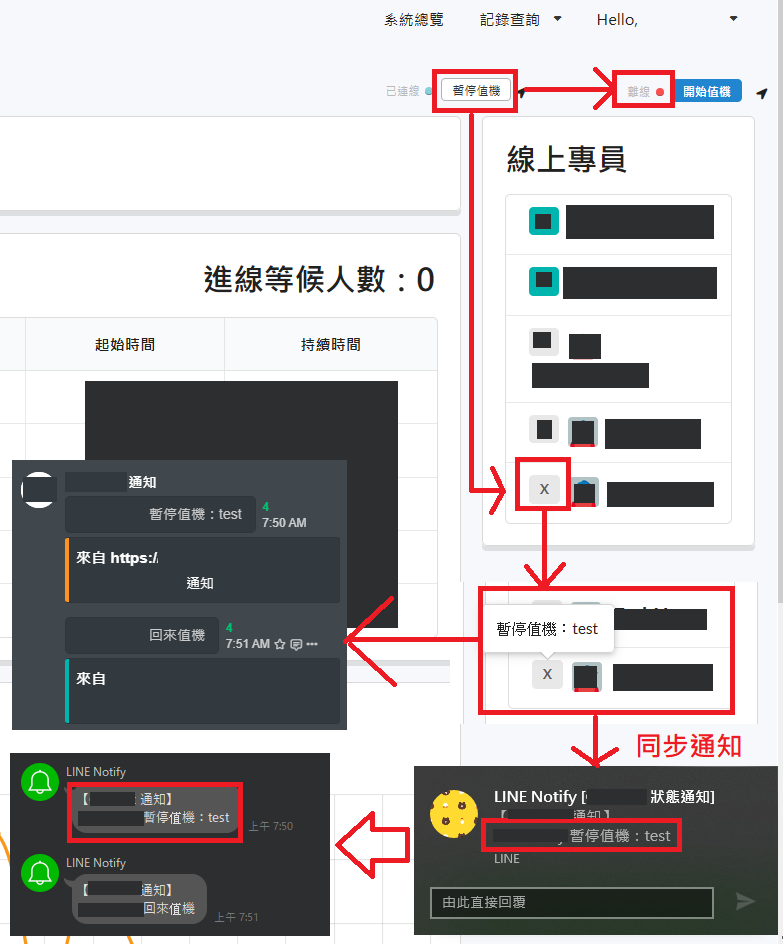](55.png)
  - 後送平台互動更新時，即時自動通報 LINE 通知：
  後送案件狀態進度變化資訊立刻掌握
[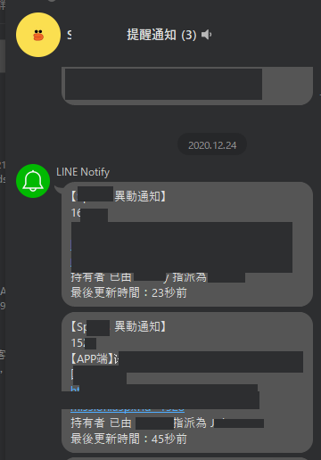](44.png)

[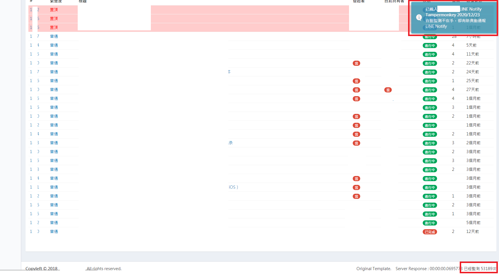](45.png)
  - 牌價及其他原需人力監控，改為自動監控自動告警：
[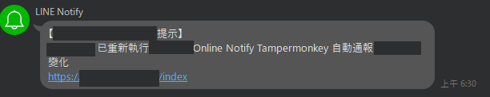](46.png)
[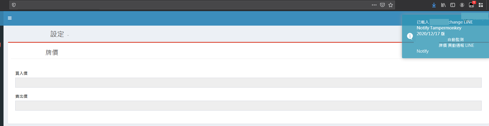](47.png)
  部分原指派定期肉眼觀測數據，加程式自動比對，異常自動通報 LINE 群組。

## 根據技術客服內需要，主動幫買網域集結開發工具

- 搭配 Google Sheet 網路班表制，獨立開發 Google 日曆及 自動LINE 、JANDI 同步提醒通知資訊，同步定時提醒各群組。

- 開發驗 Sign 工具：
算出每個 JSON 應有的正確 Sign
並自動產生每次個案計算的完整程式設計拆解步驟說明，
產生變動性話術罐頭，讓對方程式設計人員明白正確的設計癥結。
[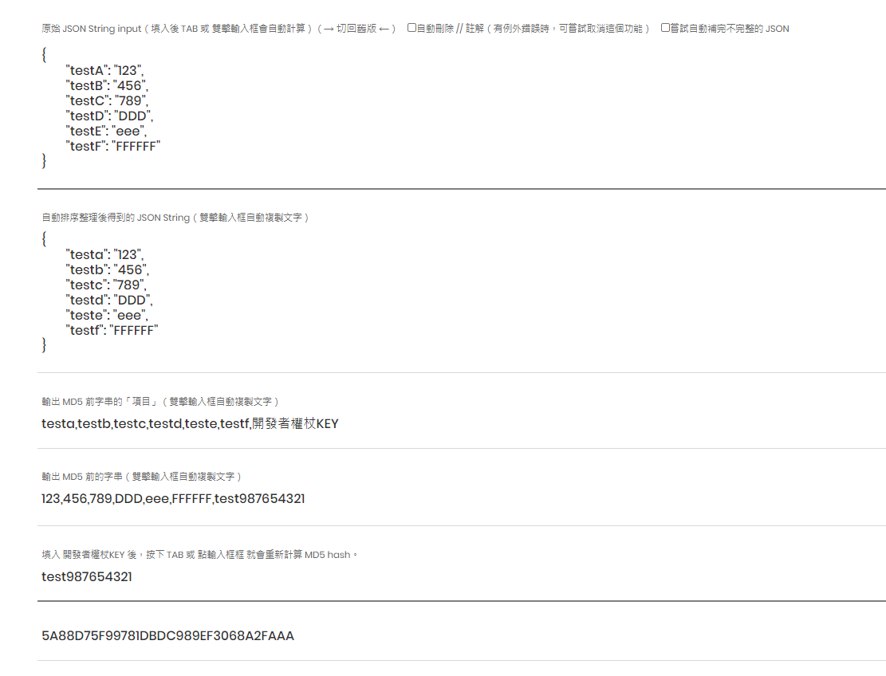](49.png)
[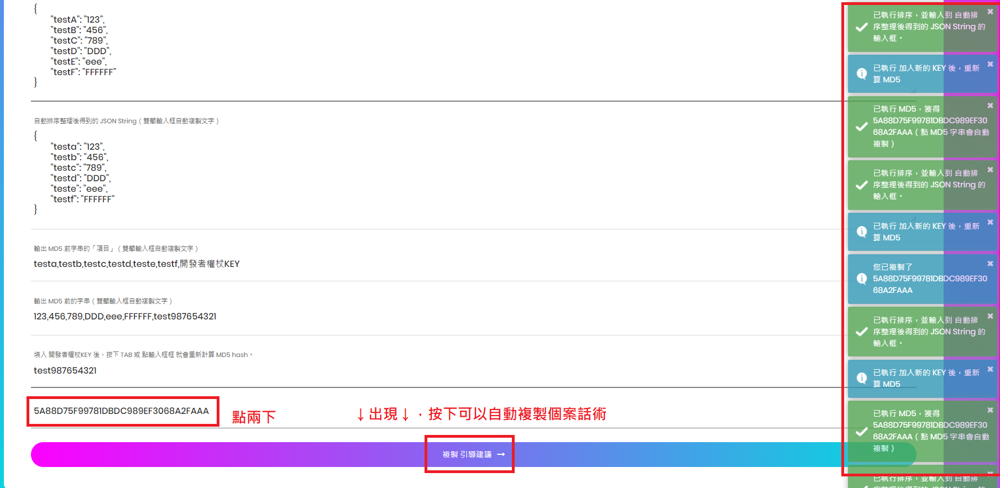](50.png)
- 針對 公司 API JSON 結構開發JSON 分析工具：
快速預判用戶提供的 JSON 使用公司哪隻 API 結構
[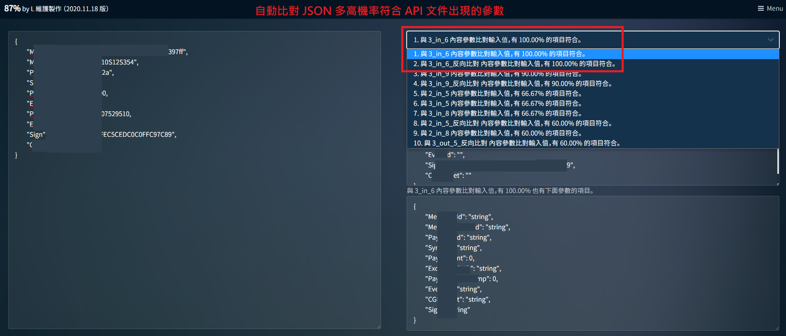](51.png)
- 接收 POST 的簡易測試環境：POST 到目標 URL，LINE Notify 呈現群組研究案例。
產生簡易 CallBack 測試 API 用於接收任何 POST，
用公司API 並填寫 CallBack 主機地址時，可測試得到的 CallBack JSON 回應。
直接由 LINE Notify 原封不動呈現，FAE 內部針對個案多人同時討論客戶問題。
[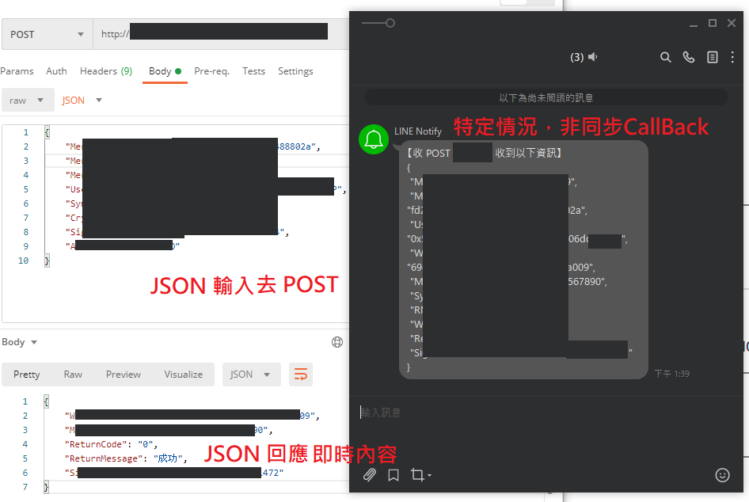](52.png)

----

# 2019.11.11 至 2020.07.31 擔任 ISP 網路供應業者的網路技術客服（TSR / Technical Support Representative）

## 任職後，應用本身擅長的資訊整合即時通報概念，

與 TSR 會程式的學長介紹 LINE Notify 引進程式串接可能性，
親自寫範例程式接 LINE Notify、JANDI.com 供參考。
間接導入內部即時自動通報各部門主管的實踐：

- 監控客服中心電話接聽狀況，定時通報服務狀態即時通知。
- 監控客服中心電話接聽狀況，異常爆量緊急即時通知。
- 監控維修量短時間異常增加，自動通報網管中心確認是否外線故障。
- 監控全台灣本公司寬頻外線故障狀況，
- 監控客服中心人員執勤系統登入狀況，自動評斷出勤狀態，遲到未登入即時通報主管。

## 自主開發程式，串接 [LINE Notify](https://notify-bot.line.me/zh_TW/)、[JANDI.com](https://www.jandi.com) 通知 TSR 技術客服組內：
- 首創建置技術客服自己內部，每日自動 LINE 提醒出勤人員班別預覽出勤狀況！

- LINE Notify 通報系統異常自動記錄 LOG，以其他通訊即時通知本組技術客服排除。

- 建置本組內部網站
- 本人開發項目，程式運作過程即時通報並留下運作 LOG

- 開發建設專屬本組內部類 Wiki 公佈欄
純前端 JavaScript 建立 DOM、進入前加上 LINE Login 控管白名單閱讀權限。

----

## 根據技術客服內需要，主動幫買網域並獨立開發相關工具及 JavaScript 擴充功能。
協助解決問題，滿足需求。

  0. 無償提供購買網域並負責管理，僅供組內使用
  因涉及部分管制資訊，這裡不便詳細紀載哪個網域。
  如有機會可以現場示範。
  1. 撥出電話自動通知案件資訊，提示撥電話的操作者。
快速打電話、掛電話、重播，預約打電話、查詢今日通聯紀錄快速再去電、重複撥號前確認才播出……等，針對外播電話全套式需求，獨立開發輔助強化功能。
    - 快速打電話

    - 快速複製前一筆電話號碼

    - 重複播號提示，避免重複播打到已結案客人

    - 按下 HOME 鍵更多快速按鈕及功能

    - 額外建立詳細播號記錄（原本系統沒有）

    - 運作過程 Console 也留有電話記錄

    - 預約回電

    - 修改電話記錄提示

    - 匯出後的外播電話記錄有自動加密電話號碼

  2. 主動開發受理追加維修網頁介面：
提交後自動產生通知字串通知工程部門的 LINE  群組。

[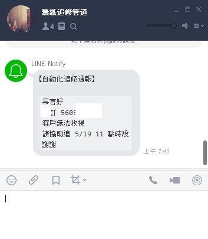](14.jpg)

  3. 維運技術客服組內伺服器及設定
並監控伺服器異常時通知 [LINE Notify](https://notify-bot.line.me/zh_TW/) 及 [JANDI.com](https://www.jandi.com)
    - 導入主機監控並自動通報異常狀態

----

## 其他工作項目

- 新申裝寬頻用戶滿意度調查及後送其他部門分析
  

----

# 2019 於 CCNDA.org 網路發展協會 主動程式開發

- [為孩子禱告 LINE 傳播替代方案 - 完成程式開發簡報](https://docs.google.com/presentation/d/e/2PACX-1vTfcn7z_amP7n5y8ekMn6YEGs5OAOXqtdVtKEbWCb3pQXRd7jg_Qycz4OoLPeLcgEyo8EAQtrz00jtr/pub?start=false&loop=true&delayms=120000&slide=id.g35f391192_00)
  - [主動程式開發完成後，經測試可行於官方網站公告 LINE 替代方案](https://www.ccnda.org/2019/03/3395)
  - [LINE 替代方案報告](https://www.ccnda.org/2019/04/3399)
  - 實際操作影片（錄製、字幕、發布皆獨立完成）：
個人訂閱介紹： http://bit.ly/praynotifyforone
群組訂閱介紹：http://bit.ly/praynotifyforgroup
[點我播放](https://www.youtube.com/embed/U3IaHwWKXcA?cc_lang_pref=tw&cc_load_policy=1&autoplay=1)
- [CCNDA APP - 提案企劃 簡報](https://docs.google.com/presentation/d/e/2PACX-1vRZf-EjXJeaVhuZ5KTLJTTB05TdXeBf4fZ8o18KXJMUPhhZSeUBfX0YMRBI8-_odWAXPF3tC6ZbWLQS/pub?start=false&loop=true&delayms=1200000&slide=id.g35f391192_00)
- 企劃教會外觀收集活動網站與獎勵機制提案（細節功能企劃設計流程圖）

# 其他近期後端經驗如下

- Golang 寫過 LINE BOT 應用範例：
https://line.me/R/ti/p/%40rgp6918s

可以查詢多國語言的聖經指定章節，一次列出

原始碼存放在
https://github.com/lanco2017/k/tree/20170208part

